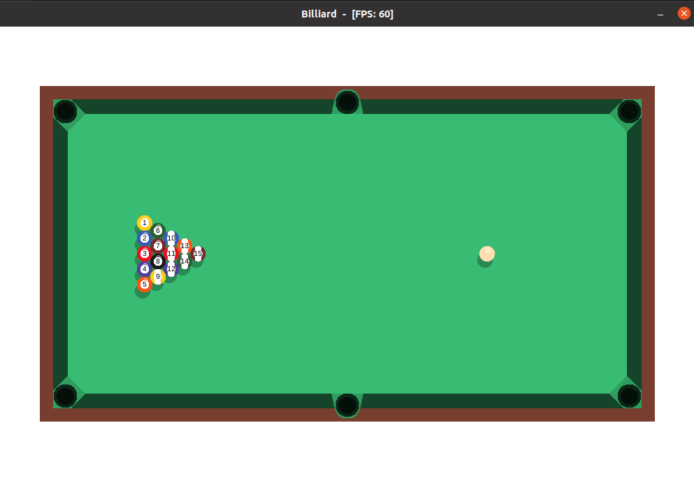

Billiard Ruby with Gosu
=============

Billiard - Ruby 2D Gaming powered by Gosu.



Install [Gosu library](https://www.libgosu.org/).

[Github main gosu repository](https://github.com/gosu/gosu/tree/master/examples).

To install and run the `billiard-ruby-gosu` with gem `gosu`:

```bash
gem install gosu
ruby billiard.rb
```
